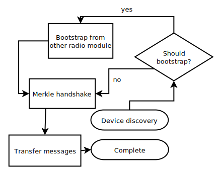

+++

+++

Scatterbrain is a platform for developing applications that run without servers, cell towers, or the internet in general. This is done using a store-and-forward gossip protocol leveraging multiple transports, most of which are usable on an unmodified android phone. No hardware required. Even though the range of most transports supported by a smartphone are low (30-100 meters), people move messages great distances offline on their phone's storage just by following their everyday schedules. Messages spread like rumors throughout your social network.

## Core philosophy and assumptions
Scatterbrain is built with vastly different design constraints than more traditional mesh networks. At it's core, Scatterbrain's design makes the following key assumptions:

1. Network nodes are exceedingly rare. The average "mesh" will contain 2 devices
2. Contact between devices will be short, and therefore efficiency in exchanging messages and the reduction of duplicate transmissions is more important than being "smart" in routing messages to specific destinations
3. Time between contacts can be very long, on the order of weeks or months
4. The average user will be incapable or unwilling to procure custom hardware and does not possess a desktop pc
5. As messages will not have recipients or destinations, encryption is largely useless unless built into application layer software. However, cryptographic signatures and identity management is highly important.

## Applications that will NOT work well with Scatterbrain
As Scatterbrain is a very pure implementation of a delay tolerant radio network, some applications are unsuited for use with Scatterbrain. These mainly include applications demanding one-on-one messaging, timely responses from peers, or stream based protocols

1. Email and direct chat apps
2. 2 way voice/video calls
3. Realtime video game servers

## Applications that WILL work well with Scatterbrain
Scatterbrain is more suited to applications requiring posting content to a large number of users, or applications where timely responses are not required

1. Web hosting, blogging, static sites
2. Discussion forums, newsgroups, imageboards
3. Short video sharing apps (tiktok clones)

## Design principles

Scatterbrain combines multiple radio protocols with a merkle tree based datastore (similar to ipfs) to allow efficiently and intelligently syncing messages from your phone to another nearby phone running the Scatterbrain Router. This sync protocol is built on the principle of eventual consistency, guaranteeing that with enough time and with sufficient storage both devices will eventually end up with the same datastore contents. Devices with identical data will never attempt to sync with each other again, reducing battery drain.

Protocols can be combined or chosen based on context to allow balancing battery life, range, and throughput. Scatterbrain is broken up into "radio modules" each one handling a specific protocol. Each module can perform one or more of the following actions in an implementation specific manner:

1. Discover nearby devices
2. Attempt to "bootstrap" to another radio module
3. Transfer messages

## More information
